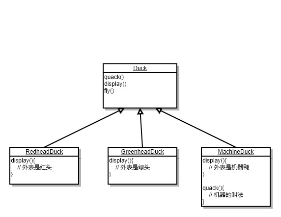

# 策略模式

> 将应用中可能变化的部分独立出来，和不需要变化的代码分开。

假设有这样一个情形，我们有一个动物园（Zoo），动物园中有一个鸭子乐园（DuckArea）。

当动物园开园后，鸭子乐园中的鸭子们就会又飞又叫（Quack、fly），而其中有红头鸭与绿头鸭。

红头鸭和绿头鸭的长相不同(display),但飞的样子和叫的样子相同。

完成开始的任务很容易，比如建给基类Duck，再设计两个子类就完事了。

**比如这样设计：**

